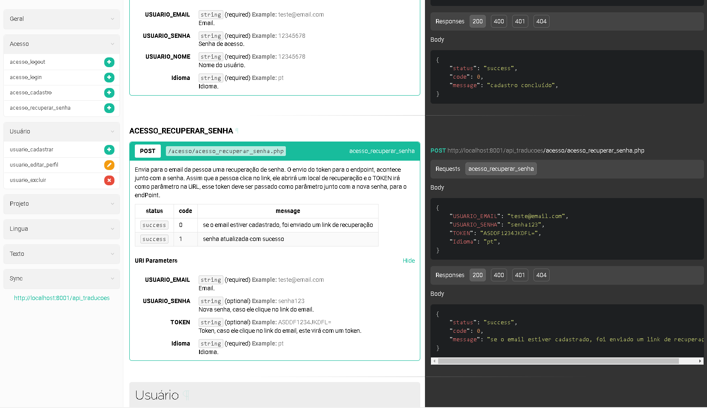

  

# Aplicativo de Traduções (REDME EM CONTRUÇÃO)

Os apps em geral precisam de tradução, não existe uma forma padrão para fazer isso, neste caso, esse app existe para resolver esse problema, é inteiramente voltado para desenvolvedores que precisam traduzir seus aplicativos!

---

## 🚀 Começando

Essas instruções permitirão que você obtenha uma cópia do projeto em operação na sua máquina local para fins de desenvolvimento e teste.

Consulte **[Implantação](#-implanta%C3%A7%C3%A3o)** para saber como implantar o projeto.

---

## :eye_speech_bubble: **Visualizar**

### :desktop_computer: Computador
  
|Desktop|
|:---:|
|<kbd></kbd>|

---
> ⚠️ O servidor de desenvolvimento foi iniciado: localmente com o banco de dados.

Qualquer um que fizer o download, poderá executar o projeto, precisando apenas de um servidor local e executar o SQL script, configurando também o banco no projeto, em geral/credetials.php.

---
## :boy: **Autor**

<a href="https://github.com/Jamallc">
 
  
 <b>Weber Rocha</b>
</a>

Desenvolvido com ❤️ por Weber Rocha 👋🏽 Entre em contato!

---
## :balance_scale: **Licença**

Copyright © 2021 [Weber Rocha](https://github.com/Jamallc). 

